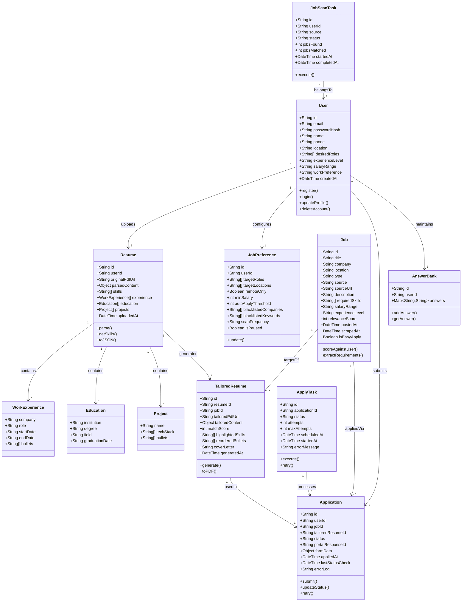

# Auto-Apply Platform — System Design

## 1. High-Level Architecture

```
┌─────────────────────────────────────────────────────────────────────┐
│                        FRONTEND (Next.js)                          │
│  ┌──────────┐ ┌──────────┐ ┌───────────┐ ┌──────────────────────┐  │
│  │ Dashboard │ │ Profile  │ │  Resume   │ │  Application Tracker │  │
│  │   Page   │ │  Setup   │ │  Upload   │ │       & Analytics    │  │
│  └──────────┘ └──────────┘ └───────────┘ └──────────────────────┘  │
└──────────────────────────┬──────────────────────────────────────────┘
                           │ REST API
┌──────────────────────────▼──────────────────────────────────────────┐
│                     BACKEND API (Node.js)                           │
│  ┌──────────┐ ┌──────────┐ ┌───────────┐ ┌───────────────────────┐ │
│  │ Auth     │ │ User     │ │ Job       │ │ Application           │ │
│  │ Module   │ │ Module   │ │ Module    │ │ Module                │ │
│  └──────────┘ └──────────┘ └───────────┘ └───────────────────────┘ │
└───────┬──────────────┬──────────────┬───────────────┬──────────────┘
        │              │              │               │
   ┌────▼────┐   ┌─────▼─────┐  ┌────▼────┐   ┌─────▼──────┐
   │PostgreSQL│   │  Redis +  │  │  AI/LLM │   │ Playwright │
   │   DB    │   │  BullMQ   │  │ Service  │   │  Workers   │
   └─────────┘   │  (Queue)  │  │ (Python) │   │  (Apply)   │
                 └───────────┘  └──────────┘   └────────────┘
```

---

## 2. Class Diagram

> See rendered Mermaid diagram below. Key entities and their relationships:



---

## 3. Component Details

### 3.1 Frontend (Next.js + TypeScript)

| Page | Purpose |
|------|---------|
| `/` | Landing page + login |
| `/dashboard` | Overview: today's stats, recent applications, active jobs |
| `/profile` | Edit profile, upload resume, set preferences |
| `/jobs` | Browse discovered jobs, relevance scores, approve/reject |
| `/applications` | Full application history with filters |
| `/settings` | Scan frequency, auto-apply threshold, blacklists, pause/resume |

### 3.2 Backend API (Node.js + Express)

| Endpoint Group | Key Endpoints |
|----------------|--------------|
| `POST /api/auth/*` | Register, login, logout, refresh token |
| `GET/PUT /api/user/profile` | Get/update user profile |
| `POST /api/resume/upload` | Upload + trigger parsing |
| `GET /api/resume/parsed` | Get parsed resume content |
| `GET /api/jobs` | List discovered jobs (paginated, filtered) |
| `POST /api/jobs/scan` | Trigger manual job scan |
| `GET /api/applications` | List all applications |
| `POST /api/applications/:jobId/apply` | Trigger apply for a specific job |
| `PUT /api/preferences` | Update job preferences |
| `GET /api/analytics` | Application stats |

### 3.3 AI/LLM Service (Python + Flask)

| Endpoint | Purpose |
|----------|---------|
| `POST /parse-resume` | PDF → structured JSON (skills, experience, education) |
| `POST /parse-job` | Job description → required skills, qualifications |
| `POST /tailor-resume` | Master resume + JD → tailored resume JSON |
| `POST /generate-cover-letter` | Template + JD → cover letter text |
| `POST /score-match` | Resume vs JD → relevance score (0–100) |

### 3.4 Job Scraper Workers

```
┌────────────────────────────────────────────┐
│            Job Scan Scheduler              │
│         (BullMQ Repeatable Job)            │
└──────────────┬─────────────────────────────┘
               │ Enqueues per source
    ┌──────────▼──────────┐
    │   Scraper Worker    │
    │  ┌───────────────┐  │
    │  │ LinkedInScraper│  │
    │  │ IndeedScraper  │  │
    │  │ NaukriScraper  │  │
    │  │ GlassdoorScr.  │  │
    │  └───────────────┘  │
    └──────────┬──────────┘
               │ New jobs
    ┌──────────▼──────────┐
    │  Dedup + Score +    │
    │  Store in DB        │
    └─────────────────────┘
```

### 3.5 Auto-Apply Workers (Playwright)

```
┌─────────────────────────────────┐
│       Apply Queue (BullMQ)      │
│  Job: { jobId, userId, resumeUrl}│
└──────────────┬──────────────────┘
               │
    ┌──────────▼──────────┐
    │  Apply Worker        │
    │  1. Get tailored PDF │
    │  2. Launch browser   │
    │  3. Navigate to URL  │
    │  4. Fill form fields │
    │  5. Upload resume    │
    │  6. Submit           │
    │  7. Log result       │
    └─────────────────────┘
```

---

## 4. Database Schema (PostgreSQL)

```sql
-- Users
CREATE TABLE users (
    id            UUID PRIMARY KEY DEFAULT gen_random_uuid(),
    email         VARCHAR(255) UNIQUE NOT NULL,
    password_hash VARCHAR(255) NOT NULL,
    name          VARCHAR(255) NOT NULL,
    phone         VARCHAR(20),
    location      VARCHAR(255),
    desired_roles TEXT[],
    experience_level VARCHAR(50),
    salary_min    INTEGER,
    salary_max    INTEGER,
    work_preference VARCHAR(20), -- remote / onsite / hybrid
    created_at    TIMESTAMPTZ DEFAULT NOW(),
    updated_at    TIMESTAMPTZ DEFAULT NOW()
);

-- Resumes
CREATE TABLE resumes (
    id              UUID PRIMARY KEY DEFAULT gen_random_uuid(),
    user_id         UUID REFERENCES users(id) ON DELETE CASCADE,
    original_pdf_url VARCHAR(500) NOT NULL,
    parsed_content  JSONB NOT NULL,       -- full structured resume
    skills          TEXT[],
    uploaded_at     TIMESTAMPTZ DEFAULT NOW()
);

-- Job Preferences
CREATE TABLE job_preferences (
    id                    UUID PRIMARY KEY DEFAULT gen_random_uuid(),
    user_id               UUID UNIQUE REFERENCES users(id) ON DELETE CASCADE,
    target_roles          TEXT[],
    target_locations      TEXT[],
    remote_only           BOOLEAN DEFAULT FALSE,
    min_salary            INTEGER,
    auto_apply_threshold  INTEGER DEFAULT 75,
    blacklisted_companies TEXT[],
    blacklisted_keywords  TEXT[],
    scan_frequency        VARCHAR(10) DEFAULT '12h',
    is_paused             BOOLEAN DEFAULT FALSE
);

-- Jobs
CREATE TABLE jobs (
    id              UUID PRIMARY KEY DEFAULT gen_random_uuid(),
    title           VARCHAR(500) NOT NULL,
    company         VARCHAR(255) NOT NULL,
    location        VARCHAR(255),
    job_type        VARCHAR(50),          -- full-time / contract / intern
    source          VARCHAR(50) NOT NULL, -- linkedin / indeed / naukri / glassdoor
    source_url      VARCHAR(1000) UNIQUE NOT NULL,
    description     TEXT NOT NULL,
    required_skills TEXT[],
    salary_range    VARCHAR(100),
    experience_level VARCHAR(50),
    is_easy_apply   BOOLEAN DEFAULT FALSE,
    posted_at       TIMESTAMPTZ,
    scraped_at      TIMESTAMPTZ DEFAULT NOW()
);

-- Tailored Resumes
CREATE TABLE tailored_resumes (
    id                UUID PRIMARY KEY DEFAULT gen_random_uuid(),
    resume_id         UUID REFERENCES resumes(id) ON DELETE CASCADE,
    job_id            UUID REFERENCES jobs(id) ON DELETE CASCADE,
    tailored_pdf_url  VARCHAR(500),
    tailored_content  JSONB NOT NULL,
    match_score       INTEGER NOT NULL,
    highlighted_skills TEXT[],
    cover_letter      TEXT,
    generated_at      TIMESTAMPTZ DEFAULT NOW()
);

-- Applications
CREATE TABLE applications (
    id                  UUID PRIMARY KEY DEFAULT gen_random_uuid(),
    user_id             UUID REFERENCES users(id) ON DELETE CASCADE,
    job_id              UUID REFERENCES jobs(id) ON DELETE CASCADE,
    tailored_resume_id  UUID REFERENCES tailored_resumes(id),
    status              VARCHAR(50) DEFAULT 'queued',
    form_data           JSONB,
    applied_at          TIMESTAMPTZ,
    last_status_check   TIMESTAMPTZ,
    error_log           TEXT,
    created_at          TIMESTAMPTZ DEFAULT NOW(),
    UNIQUE(user_id, job_id)
);

-- Answer Bank (common application questions)
CREATE TABLE answer_bank (
    id        UUID PRIMARY KEY DEFAULT gen_random_uuid(),
    user_id   UUID REFERENCES users(id) ON DELETE CASCADE,
    question  VARCHAR(500) NOT NULL,
    answer    TEXT NOT NULL,
    UNIQUE(user_id, question)
);

-- Job Scan Tasks
CREATE TABLE job_scan_tasks (
    id           UUID PRIMARY KEY DEFAULT gen_random_uuid(),
    user_id      UUID REFERENCES users(id) ON DELETE CASCADE,
    source       VARCHAR(50) NOT NULL,
    status       VARCHAR(50) DEFAULT 'pending',
    jobs_found   INTEGER DEFAULT 0,
    jobs_matched INTEGER DEFAULT 0,
    started_at   TIMESTAMPTZ,
    completed_at TIMESTAMPTZ
);
```

---

## 5. Data Flow

### 5.1 Job Discovery Flow

```
User sets preferences
        │
        ▼
Scheduler triggers scan (every N hours)
        │
        ▼
Scraper workers fetch jobs from LinkedIn, Indeed, etc.
        │
        ▼
Deduplicate against existing jobs in DB
        │
        ▼
AI Service scores each job (resume vs JD)
        │
        ▼
Store jobs with relevance score
        │
        ▼
If score ≥ threshold → enqueue for auto-apply
```

### 5.2 Apply Flow

```
Job enters apply queue
        │
        ▼
AI Service generates tailored resume + cover letter
        │
        ▼
Tailored resume saved as PDF
        │
        ▼
Playwright worker opens job URL
        │
        ▼
Fill form using profile + answer bank
        │
        ▼
Upload tailored resume PDF
        │
        ▼
Submit application
        │
        ▼
Log result → update application status
        │
        ▼
Wait (rate-limit delay) → process next
```

---

## 6. Folder Structure

```
auto-apply/
├── apps/
│   ├── web/                    # Next.js frontend
│   │   ├── src/
│   │   │   ├── app/            # App router pages
│   │   │   ├── components/     # UI components
│   │   │   ├── lib/            # API client, utils
│   │   │   └── types/          # TypeScript types
│   │   ├── public/
│   │   └── package.json
│   │
│   └── api/                    # Node.js backend
│       ├── src/
│       │   ├── routes/         # Express route handlers
│       │   ├── services/       # Business logic
│       │   ├── models/         # DB models (Prisma/Drizzle)
│       │   ├── workers/        # BullMQ workers
│       │   │   ├── jobScanWorker.ts
│       │   │   └── applyWorker.ts
│       │   ├── scrapers/       # Job source scrapers
│       │   │   ├── linkedinScraper.ts
│       │   │   ├── indeedScraper.ts
│       │   │   ├── naukriScraper.ts
│       │   │   └── baseScraper.ts
│       │   ├── automation/     # Playwright apply scripts
│       │   │   ├── linkedinApply.ts
│       │   │   ├── indeedApply.ts
│       │   │   ├── naukriApply.ts
│       │   │   └── baseApply.ts
│       │   ├── middleware/     # Auth, rate-limit, error handler
│       │   └── config/        # DB, Redis, env config
│       └── package.json
│
├── services/
│   └── ai-service/            # Python Flask AI service
│       ├── app.py
│       ├── resume_parser.py
│       ├── job_parser.py
│       ├── resume_tailor.py
│       ├── cover_letter.py
│       ├── scorer.py
│       └── requirements.txt
│
├── prisma/
│   └── schema.prisma          # Database schema
│
├── docker-compose.yml         # PostgreSQL + Redis + services
├── requirements.md
├── system-design.md
└── README.md
```

---

## 7. Key Design Decisions

| Decision | Choice | Rationale |
|----------|--------|-----------|
| Monorepo vs Polyrepo | Monorepo (apps/) | Simpler for single developer, shared types |
| ORM | Prisma | Type-safe, great DX, auto-migration |
| Queue | BullMQ (Redis) | Lightweight, Node.js native, battle-tested |
| AI Service separate | Python Flask microservice | LLM libraries are Python-first (langchain, openai) |
| Browser automation | Playwright | You have experience, multi-browser support |
| Resume PDF output | Puppeteer (HTML→PDF) | Full control over layout with HTML/CSS templates |

---

## 8. Security Considerations

- **Credentials storage**: User portal credentials (LinkedIn, etc.) encrypted with AES-256-GCM, encryption key from env var
- **JWT auth**: Short-lived access tokens (15m) + refresh tokens (7d)
- **Rate limiting**: Per-user limits on API + per-source limits on scraping
- **Input validation**: Zod schemas on all API inputs
- **No credential logging**: Sensitive fields redacted from logs
- **CORS**: Restricted to frontend origin only
